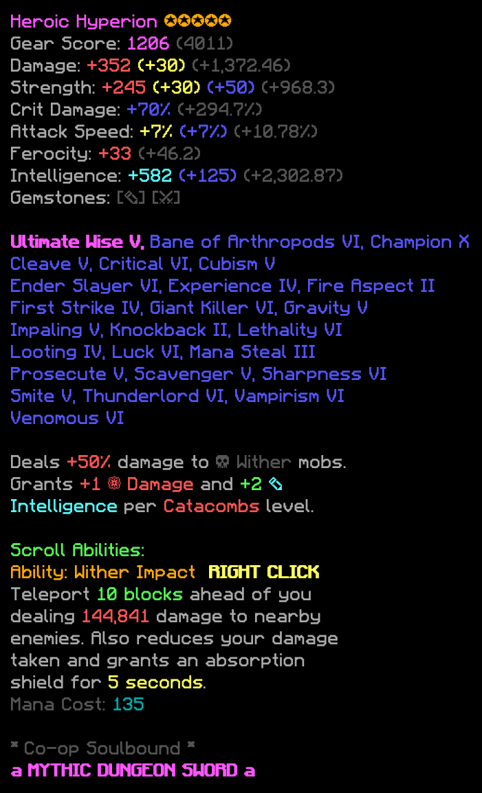
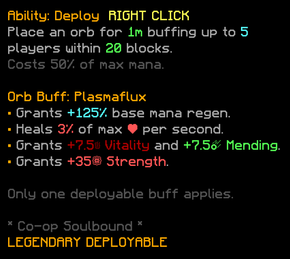

<div align="center">

# 🗡️ Skyblock Lore Renderer

### 🎨 Turn Minecraft Hypixel Skyblock item lore into beautiful images

[](https://www.rust-lang.org)
[](LICENSE)

<p align="center">
  
</p>

</div>

---

## ✨ Features

| Feature | Description |
|---------|-------------|
| 🎨 **Full Color Support** | Renders all Minecraft § format codes with accurate colors |
| ✨ **Bold Text** | Supports `§l` bold formatting with proper offset rendering |
| 🔤 **Faithful Font** | Uses the iconic Minecraft Faithful Unicode font for authentic look |
| 📏 **Auto-sizing** | Automatically calculates image dimensions based on text content |
| ⚡ **Fast & Lightweight** | Pure Rust with minimal dependencies — blazing fast rendering |

---

## 🚀 Quick Start

### Prerequisites
- [Rust](https://rustup.rs/) 1.70 or later

### Installation

```bash
# Clone the repository
git clone https://github.com/megawattka/skyblock-lore-renderer.git
cd skyblock-lore-renderer

# Build in release mode
cargo build --release

```

---

## 📖 Usage

```bash
skyblock-lore-renderer <input.txt> <output.png>
```

### Example

```bash
# Render a Hyperion sword lore
./skyblock-lore-renderer examples/hyperion.txt my_hyperion.png

# Render a Plasmaflux Power Orb
./skyblock-lore-renderer examples/plasmaflux.png my_orb.png
```

---

## 📝 Lore Format

The renderer supports standard Minecraft `§` format codes:

| Code | Color | Preview |
|------|-------|---------|
| `§0` | Black | ⬛ |
| `§1` | Dark Blue | 🟦 |
| `§2` | Dark Green | 🟩 |
| `§3` | Dark Aqua | 🩵 |
| `§4` | Dark Red | 🟥 |
| `§5` | Dark Purple | 🟪 |
| `§6` | Gold | 🟨 |
| `§7` | Gray | ⬜ |
| `§8` | Dark Gray | 🔲 |
| `§9` | Blue | 🔵 |
| `§a` | Green | 🟢 |
| `§b` | Aqua | 🩵 |
| `§c` | Red | 🔴 |
| `§d` | Light Purple | 🩷 |
| `§e` | Yellow | 🟡 |
| `§f` | White | ⚪ |
| `§l` | **Bold** | **B** |

### Example Input File

```text
§dHeroic Hyperion §6✪✪✪✪✪
§7Gear Score: §d1206 §8(4011)
§7Damage: §c+352 §e(+30) §8(+1,372.46)
§7Strength: §c+245 §e(+30) §9(+50) §8(+968.3)
§7Crit Damage: §9+70% §8(+294.7%)
§7Intelligence: §b+582 §9(+125) §8(+2,302.87)

§d§lUltimate Wise V, §9Bane of Arthropods VI
§9Champion X, §9Cleave V, §9Critical VI

§7Deals §c+50% §7damage to §8☠ Wither §7mobs.
§7Grants §c+1 §c❁ Damage §7and §a+2 §b✎ Intelligence §7per §cCatacombs §7level.

§6Ability: Wither Impact §e§lRIGHT CLICK
§7Teleport §a10 blocks§7 ahead of you
§7dealing §c144,841 §7damage to nearby enemies.

§8§l* §8Co-op Soulbound §8§l*
§d§l§ka§r §d§lMYTHIC DUNGEON SWORD §d§l§ka
```

---

## 🖼️ Examples

### Plasmaflux Power Orb — Legendary Deployable
<p align="center">
  
</p>

---

## 🏗️ Architecture

```
skyblock-lore-renderer/
├── 📁 src/
│   ├── 📄 main.rs      # CLI entry point, image generation
│   └── 📄 lore.rs      # Lore parsing, text rendering, format code handling
├── 📁 examples/
│   ├── 📄 hyperion.txt     # Example: Mythic Hyperion lore
│   ├── 📄 hyperion.png     # Rendered output
│   ├── 📄 plasmaflux.txt   # Example: Legendary Plasmaflux
│   └── 📄 plasmaflux.png   # Rendered output
├── 📁 fonts/
│   └── 🔤 faithful-unicode.ttf   # Minecraft Faithful font
├── 📄 Cargo.toml
└── 📄 .env
```

### How It Works

1. 📖 **Parse** — Regex extracts `§` format codes and text segments
2. 🎨 **Colorize** — Maps format codes to RGB colors via `phf` static map
3. 📐 **Measure** — Calculates text width using `ab_glyph` for proper image sizing
4. ✍️ **Render** — Draws text onto an `RgbImage` with `imageproc`
5. 💾 **Save** — Exports the final image as PNG

---

## 🛠️ Tech Stack

| Crate | Purpose |
|-------|---------|
| 🖼️ `image` + `imageproc` | Image creation and text drawing |
| 🔤 `ab_glyph` | Font loading and glyph metrics |
| ⚡ `phf` | Compile-time perfect hash maps for color codes |
| 📝 `regex` | Lore format code parsing |
| 🌿 `dotenvy` | Environment configuration |
| 📋 `anyhow` | Ergonomic error handling |
| 🪵 `log` + `env_logger` | Structured logging |

---

## 🎯 Roadmap

- [x] 🎨 Basic color format code support
- [x] ✨ Bold text rendering (`§l`)
- [ ] 🔄 Italic support (`§o`)
- [ ] ➖ Strikethrough support (`§m`)
- [ ] ➖ Underline support (`§n`)
- [ ] 🖼️ Custom background support

---

## 📜 License

This project is licensed under the **MIT License**.

---

<div align="center">

### Made with ⚡ by [megawattka](https://github.com/megawattka)

*Not affiliated with Hypixel or Mojang Studios*

⭐ Star this repo if you find it useful!

</div>
